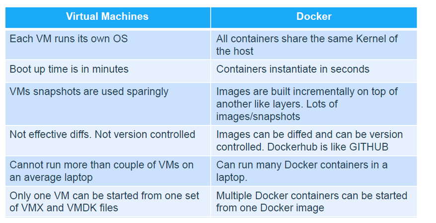
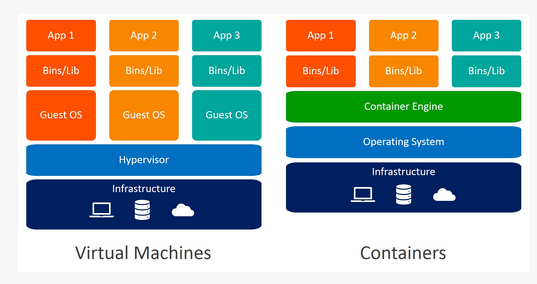

# Inception

## Table of Contents

- [Pre-requisites](#Pre-Requisites)
  - [Create a Virtual Machine](#Create-a-Virtual-machine)

  - [Setting up Shared Folder](#setting-up-shared-folder-in-ubuntu-vm-with-virtualbox-guest-additions)
    - [Install VirtualBox Guest Additions](#install-virtualbox-guest-additions)
    - [Update and Install Required Packages](#update-and-install-required-packages)
    - [Mount the Guest Additions CD](#mount-the-guest-additions-cd)
    - [Install Guest Additions](#install-guest-additions)
    - [Create a Shared Folder](#create-a-shared-folder)
    - [Mount the Shared Folder](#mount-the-shared-folder)
    - [Mount a Permanent Shared Folder](#mount-a-permanent-shared-folder)

- [Inception](#inception-1)
  - [Install all the requirements](#install-all-the-requirements)
  - [Docker-Compose](#docker-compose)
    - [Install Docker-compose](#install-docker-compose)
    - [Docker Compose - Commands](#docker-compose-commands)
    - [Docker Compose - file](#docker-compose-file)
  - [Mariadb](#mariadb)
    - [Flags](#flags)
    - [Commands](#commands)
    - [Example of a Docker File](#example-of-a-docker-file)
    - [Config Example](#config-example)
  - [Nginx](#nginx)
    - [Install Nginx](#install-nginx)
    - [Example of a Docker File](#example-of-a-docker-file_1)
    - [Nginx Config](#nginx-config)

-------------------------------------------------------------------------
# Pre-Requisites
For this project, you need a virtual machine where you will test the project. You will also need to have a folder shared between your computer and your Virtual Machine.

## Create a Virtual machine
Do you remember Born2beRoot? 
I left here a guide to Born2beRoot: https://github.com/pasqualerossi/Born2BeRoot-Guide#part-2---installing-your-virtual-machine

## Setting up Shared Folder in Ubuntu VM with VirtualBox Guest Additions

### Install VirtualBox Guest Additions

1. Start your Ubuntu VM.
2. In the VirtualBox menu, navigate to "Devices" > "Insert Guest Additions CD image."

### Update and Install Required Packages

```bash
sudo apt update -y
sudo apt upgrade -y
sudo apt install -y \
	 build-essential \
	 dkms \
	 linux-headers-$(uname -r)
```

### Install Guest Additions


# try do mount the Guest Additions

```bash
mkdir /media/cdrom
sudo mount /dev/cdrom /media/cdrom
cd /media/cdrom
sudo ./VBoxLinuxAdditions.run
sudo shutdown -r now
```

if this doesn't work means that the machine already mount the cd
so try to enter in the next path to install the Guest Additions

```bash
cd /media/$(hostname)
cd /VBox_GAs_<version>
sudo ./VBoxLinuxAdditions.run
sudo shutdown -r now
```

### Create a Shared Folder
- In VirtualBox, select your VM.
- Navigate to "Settings" > "Shared Folders."
- Add a new shared folder, specifying the folder path on your host machine.

### Mount the Shared Folder

#### Change the name Shared with the name of your Shared Folder

```bash
sudo mkdir /mnt/shared
sudo mount -t vboxsf Shared /mnt/shared/
cd /mnt/shared
```

### Mount a Permenent Shared Folder

#### open with sudo the file

```bash
sudo nano /etc/fstab
```
#### Add the Next Line

```bash
<Shared_Folder_Name> /mnt/shared vboxsf defaults 0 0
```
#### Save the file and try this

```bash
systemctl daemon-reload # reload the config of fstab
sudo mount -a
```

-------------------------------------------------------------------------

# Inception

## Install  all the requirements

### Uninstall all the previus docker packages

```bash
 for pkg in docker.io docker-doc docker-compose docker-compose-v2 podman-docker containerd runc; do sudo apt-get remove $pkg; done
```

### Install the basic packages

```bash
#!/bin/bash

sudo apt-get update	-y > /dev/null
sudo apt-get install 	-y \
			build-essential \
			dkms \
			linux-headers-$(uname -r) \
		     	ca-certificates \
			curl \
			gnupg \
			git > /dev/null # this is not necessary

# create a new directory named keyrings in the /etc/apt directory and set its permissions to 755.
sudo install -m 0755 -d /etc/apt/keyrings > /dev/null
```

### Install the docker

```bash
#!/bin/bash

# This command downloads the Docker apt key from the Docker website, decrypts it, and saves it to the file /etc/apt/keyrings/docker.gpg
# this is needed to apt trust the docker package
curl -fsSL https://download.docker.com/linux/ubuntu/gpg | sudo gpg --dearmor -o /etc/apt/keyrings/docker.gpg > /dev/null
sudo chmod a+r /etc/apt/keyrings/docker.gpg > /dev/null

# Add the repository to Apt sources:
echo "deb [arch=$(dpkg --print-architecture) signed-by=/etc/apt/keyrings/docker.gpg] https://download.docker.com/linux/ubuntu $(. /etc/os-release && echo "$VERSION_CODENAME") stable" | \
  	sudo tee /etc/apt/sources.list.d/docker.list > /dev/null

sudo apt-get update	-y > /dev/null
sudo apt-get upgrade	-y > /dev/null

# Install the Docker Packeges
sudo apt-get install 	-y \
			docker-ce \
			docker-ce-cli \
			containerd.io \
			docker-buildx-plugin \
			docker-compose-plugin > /dev/null

sudo service docker start > /dev/null
sudo docker run hello-world

```

### Install the VS Code

```bash
#!/bin/bash

sudo snap install --classic code > /dev/null  # this is not necessary
```

-------------------------------------------------------------------------
## How Docker works?

Docker is a platform for developing, shipping, and running applications in containers. Containers are lightweight, portable, and self-sufficient units that can run applications and their dependencies.

By leveraging containerization, Docker simplifies the deployment and management of applications, making them more portable, scalable, and consistent across different environments. This is particularly valuable in modern software development practices, such as microservices architecture and continuous integration/continuous deployment (CI/CD).

## The benefit of Docker compared to VMs?

Docker and virtual machines (VMs) are both technologies that provide isolation and encapsulation, but they operate at different levels of the software stack and offer distinct benefits.

https://dockerlabs.collabnix.com/beginners/difference-docker-vm.html





## How Docker-Compose works
Docker Compose is a tool for defining and running multi-container Docker applications. With Compose, you use a YAML file to configure your application's services. Then, using a single command, you can create and start all the services from your configuration.

Using Docker Compose can simplify the process of managing multi-container applications by allowing you to define all of your services in a single place and easily start and stop them. It also makes it easy to scale your application by allowing you to increase or decrease the number of replicas of a service.

## The difference between a Docker image used with docker-compose and without docker-compose?

The fundamental difference between using a Docker image with Docker Compose and without it lies in the context and orchestration of containers.

    Without Docker Compose: Focus on individual containers, manual configuration, and less streamlined management for multi-container applications.

    With Docker Compose: Streamlined management for multi-container applications, organized service definitions, simplified networking, and volume management.

In summary, Docker Compose provides a higher-level abstraction for managing multi-container applications, making it easier to define, deploy, and scale complex application stacks compared to using Docker alone for individual containers.

### Docker Compose - Example file

``` Docker-Compose.yml
services:
    mariadb:
        container_name: mariadb
        build:
            context: ./requirements/mariadb
            dockerfile: Dockerfile
        env_file:
            - .env
        restart: unless-stopped
        image: mariadb
        volumes:
            - mariadb_data:/var/lib/mysql
        ports:
            - "3306:3306"
        networks:
            - myNetwork
    nginx:
        container_name: nginx
        depends_on:
            - wordpress
        build:
            context: ./requirements/nginx
            dockerfile: Dockerfile
        restart: unless-stopped
        env_file:
            - .env
        image: nginx
        volumes:
            - wordpress_data:/var/www/html
        ports:
            - "443:443"
        networks:
            - myNetwork
    wordpress:
        container_name: wordpress
        depends_on:
            - mariadb
        build:
            context: ./requirements/wordpress
            dockerfile: Dockerfile
        restart: unless-stopped
        image: wordpress
        env_file:
            - .env
        volumes:
            - wordpress_data:/var/www/html
        ports:
            - "9000:9000"
        networks:
            - myNetwork

networks:
    myNetwork:
        name: inception
        driver: bridge

volumes:
  mariadb_data:
    name: mariadb_data
    driver: local
    driver_opts:
      type: 'none'
      o: 'bind'
      device: '/tmp/data/mariadb'
  wordpress_data:
    name: wordpress_data
    driver: local
    driver_opts:
      type: 'none'
      o: 'bind'
      device: '/tmp/data/wordpress'
```

**Difference between ports and expose**
    Ports is used to map ports from the host to the container, while expose is used to make the container's ports accessible to other containers on the same Docker network.

ports: 
      - "9000:9000"
expose:
      -"9000"
    


### Docker Commands

**Building and Managing Images:**

- `docker build`: Build an image from a Dockerfile.
- `docker pull`: Pull an image or a repository from a registry.
- `docker push`: Push an image or a repository to a registry.
- `docker images` or `docker image ls`: List all images on your system.
- `docker rmi`: Remove one or more images.

**Running Containers:**

- `docker run`: Create and start a container from an image.
- `docker ps`: List all running containers.
- `docker ps -a` or `docker container ls -a`: List all containers (including stopped ones).
- `docker start`: Start a stopped container.
- `docker stop`: Stop a running container.
- `docker restart`: Restart a container.
- `docker exec`: Run a command in a running container.

**Managing Containers:**

- `docker rm`: Remove one or more containers.
- `docker rename`: Rename a container.
- `docker logs`: View the logs of a container.
- `docker top`: Display the running processes of a container.

**Network and Connectivity:**

- `docker network ls`: List all networks.
- `docker network create`: Create a network.
- `docker network connect`: Connect a container to a network.
- `docker network disconnect`: Disconnect a container from a network.
- `docker port`: List port mappings or open ports on a container.

**Volumes:**

- `docker volume ls`: List all volumes.
- `docker volume create`: Create a volume.
- `docker volume inspect`: Display detailed information about a volume.

**Docker Compose:**

- `docker-compose up`: Start services defined in a `docker-compose.yml` file.
- `docker-compose down`: Stop and remove containers, networks, and volumes defined in a `docker-compose.yml` file.
- `docker-compose ps`: List containers and their status in a Docker Compose setup.
- `docker-compose logs`: View the logs of containers in a Docker Compose setup.

**Registry and Authentication:**

- `docker login`: Log in to a Docker registry.
- `docker logout`: Log out from a Docker registry.

**System Information:**

- `docker info`: Display system-wide information.
- `docker version`: Show the Docker version information.

**Cleaning Up:**

- `docker system prune`: Remove all stopped containers, dangling images, and unused networks and volumes.


-------------------------------------------------------------------------
## Dockerfile

The dockerfile is a recipe to do a docker container. A Dockerfile is a text file that contains the instructions for building a Docker image. It specifies the base image to use, the dependencies and software to install, and any other configurations or scripts that are needed to set up the environment for the application to run.

A Dockerfile uses specific commands, such as FROM, RUN, and CMD, to define the instructions for building the image. 

1. FROM: This is a command that is used in a Dockerfile to specify the base image to use as the starting point for building the Docker image. The base image provides the foundational layers for the image, and you can then add additional layers on top of it to customize the image for your specific needs.

2. RUN: This is a command that is used in a Dockerfile to execute a command in the terminal of the container. It is typically used to install software or libraries that are needed by the application.

3. WORKDIR - sets the working directory for any RUN, CMD, ENTRYPOINT, COPY, and ADD instructions that follow it in the Dockerfile. (You go directly in the directory you choose)

4. COPY - copies new files or directories from and adds them to the filesystem of the container at the path .

5. CMD: This is a command that is used in a Dockerfile to specify the default command that should be run when a container is started from the image. It is used to specify the main command that the container should run when it is started.

ENTRYPOINT sets the main command to be run and doesn't allow easily overriding it at runtime, while CMD provides default values for the command and can be overridden by providing a command when running the container. 

-------------------------------------------------------------------------

## Mariadb

### Install

``` bash
sudo apt-get update -y
sudo apt-get install -y \
             mariadb-server
```

### Flags

- ``-h HOST``: Specify the hostname or IP address of the MariaDB server.
- ``-P PORT``: Specify the port number on which MariaDB is listening.
- ``-u USERNAME``: Specify the MariaDB username for authentication.
- ``-p``: Prompt for the password.

### Commands

**Connecting to the Database**

```bash
mysql -h HOST -P PORT -u USERNAME -p
mysql -h HOST -P PORT -u USERNAME -p DATABASE
```

**Database Management**

- Create a Database:
```sql
CREATE DATABASE IF NOT EXISTS your_database;
```

- Use a Database:
 ```sql
USE your_database;
```

- List Databases:
```sql
SHOW DATABASES;
```

**User Management**

- Create a User:
```sql
CREATE USER 'your_user'@'%' IDENTIFIED BY 'your_password';
```

- Grant Privileges:
```sql
GRANT ALL PRIVILEGES ON your_database.* TO 'your_user'@'%';
```

- Show User Hosts:
```sql
SELECT user, host FROM mysql.user;
```

**Table Operations**

- Create a Table:
```sql
CREATE TABLE your_table (column1 datatype, column2 datatype, ...);
```

- Insert Data into a Table:
```sql
INSERT INTO your_table (column1, column2, ...) VALUES (value1, value2, ...);
```

- Select Data from a Table:
```sql
SELECT * FROM your_table;
```

- Exit
```sql
Exit
```

### Example of a Docker File

```Dockerfile
# Dockerfile-mariadb
FROM debian:bullseye

# Install MariaDB
RUN apt-get update && \
    apt-get install -y\
            mariadb-server && \
    rm -rf /var/lib/apt/lists/*

# Create necessary directories and set permissions
RUN mkdir -p /var/run/mysqld && \
    chown -R mysql:mysql /var/run/mysqld && \
    chown -R mysql:mysql /var/lib/mysql

# Remove the default MySQL configuration
RUN rm -f /etc/mysql/my.cnf

# Copy the entrypoint script
COPY ./tools/entry.sh /tmp/entry.sh
RUN chmod 755 /tmp/entry.sh

# Set the entrypoint script as the entry point for the container
ENTRYPOINT ["/bin/bash", "/tmp/entry.sh"]
```

### Config

- **Configuration File (my.cnf)**

- this script generates a custom configuration file (.cnf) to define MariaDB settings.

```bash
echo "[client-server]
# Port or socket location where to connect
port = 3306
socket = /run/mysqld/mysqld.sock

# Import all .cnf files from configuration directory
!includedir /etc/mysql/conf.d/
!includedir /etc/mysql/mariadb.conf.d/

[mysqld]
port = 3306
bind-address = 0.0.0.0
" > /etc/mysql/my.cnf

```

- **Secure Installation**

- The script checks if the specified database directory exists. If not, it runs the mysql_secure_installation script for enhanced security

```bash
if [ ! -d "/var/lib/mysql/$MYSQL_DATABASE" ]; then
    mysql_secure_installation << EOF
$MYSQL_ROOT_PASSWORD
y
n
y
y
y
y
EOF
    echo -e "\e[1;32mMySQL secure installation completed. \e[0m"
fi

```

- **Database and User Setup**

- The script proceeds to create the database and users necessary for WordPress

```bash
echo -e "\e[1;32mMariaDB Starting Setup.\e[0m"

mariadb <<EOF
CREATE DATABASE IF NOT EXISTS $MYSQL_DATABASE;
CREATE USER '$MYSQL_ADMIN_USER'@'%' IDENTIFIED BY '$MYSQL_ADMIN_PASSWORD';
GRANT ALL PRIVILEGES ON $MYSQL_DATABASE.* TO '$MYSQL_ADMIN_USER'@'%';
FLUSH PRIVILEGES;
exit
EOF

```

- **Finalization**

The script concludes by stopping MariaDB, then starting it as a server in a way to prevent the docker to restarting

```bash
exec mysqld --datadir=/var/lib/mysql
```

## Wordpress

### Install

In order to use the Wordpress we need to Intall some packages to work with Nginx

```bash
sudo apt update -y && \
sudo apt install -y \
        php7.4-fpm \
        php7.4-mysql \
        curl
```

### Config

- ***wp-config.php***

- Wordpress Config in order to communicate with our database

```php
<?php

define( 'DB_NAME', getenv('MYSQL_DATABASE') );
define( 'DB_USER', getenv('MYSQL_ADMIN_USER') );
define( 'DB_PASSWORD', getenv('MYSQL_ADMIN_PASSWORD') );
define( 'DB_HOST', 'mariadb' );
define( 'DB_CHARSET', 'utf8' );
define( 'DB_COLLATE', '' );

define('AUTH_KEY',         'nynZN@p%~s+VI2R}}wUJ[QIeCFk-DkNI)A:h=badn/,4xBpfAt,y(#,N}hnGAk [');
define('SECURE_AUTH_KEY',  '5}`z5X=]VN(~tp&pMG(~cwLoxIC`cnRqAP5Yf|f%^aN9-H+1O!|feL}slY#laZF9');
define('LOGGED_IN_KEY',    '_CI;<.-Yb#q6/C)w5BO*Qw!+rrp}umu+0bg|E,p<zdg T#E.|.<{|(BDczhL<#v(');
define('NONCE_KEY',        'M3eR`S~+F[Ie%NyZ$0x}(8:+FEp{cI?}J>J-j)cXU_Vno#,ylXd3|y`;#,fNlzX5');
define('AUTH_SALT',        'F)vM!awJo~0[A :hBe^Er1fv6uE0|*N*c+5>CYGRv` )E+@sk(&j?~@MX/d>!Tz~');
define('SECURE_AUTH_SALT', 'VK8-jb3.JA$|8]m&0TSoG#4nQ>+e1kB}A&ZYPzzJ.Ol#3  |tJlN.,IlL}.TAX5#');
define('LOGGED_IN_SALT',   'HcgLD)(7|e]E@1nh(|i~*dK+Pj*#T;rc+SR1*+{C%gQAD7is>xHT6*6O]b(J;G#m');
define('NONCE_SALT',       '=5RgOJnbZn:z7C&bv-x:O]$6cnkv.SRz!2Us F~Uvn:$PuKo8he`Wh,r!-p3x`h1');

$table_prefix = 'wp_';

define( 'WP_DEBUG', false );

if ( ! defined( 'ABSPATH' ) ) {
        define( 'ABSPATH', __DIR__ . '/' );
}

require_once ABSPATH . 'wp-settings.php';

```

- ***.conf***

- Configuration of php-fpm in other to define is Settings

```.conf
[www]
user = www-data
group = www-data
listen = wordpress:9000
listen.owner = www-data
listen.group = www-data
pm = dynamic
pm.max_children = 75
pm.start_servers = 10
pm.min_spare_servers = 5
pm.max_spare_servers = 20
pm.process_idle_timeout = 10s
clear_env = no
```


-------------------------------------------------------------------------

## Nginx

### Install

```bash
sudo apt-get update
sudo apt-get install -y \
        nginx \
        nginx-extras \
        php-fpm \
        php-mysql \
        openssl \
    && rm -rf /var/lib/apt/lists/*
```

### Example of a Docker File

- This example of dockerfile is using an nginx image to make the container as lightweight as possible.
  But could be use another type of image like a version of Debian.
```Dockerfile
FROM nginx:latest

# Install PHP and SSL-related packages
RUN apt-get update && \
    apt-get install -y \
        nginx-extras \
        php-fpm \
        php-mysql \
        openssl \
    && rm -rf /var/lib/apt/lists/*

# Copy custom Nginx configuration file
COPY nginx.conf /etc/nginx/nginx.conf
```


### Nginx Config

- File inside /etc/nginx/sites_enabled/ (You can change that name if you want to)

```Nginx
server {
        listen 80 default_server;
        listen [::]:80 default_server;
        #Server_name Server_domain.example.com


        # SSL configuration
        #
        # listen 443 ssl default_server;
        # listen [::]:443 ssl default_server;
        #
        # Note: You should disable gzip for SSL traffic.
        # See: https://bugs.debian.org/773332
        #
        # Read up on ssl_ciphers to ensure a secure configuration.
        # See: https://bugs.debian.org/765782
        #
        # Self signed certs generated by the ssl-cert package
        # Don't use them in a production server!
        #
        # include snippets/snakeoil.conf;

        root /var/www/html;

        # Add index.php to the list if you are using PHP
        index index.html index.htm index.nginx-debian.html;

        server_name _;

        location / {
                # First attempt to serve request as file, then
                # as directory, then fall back to displaying a 404.
                try_files $uri $uri/ =404;
	        # proxy_pass http://localhost:8080;
        	# proxy_http_version 1.1;
	        # proxy_set_header Upgrade $http_upgrade;
        	# proxy_set_header Connection 'upgrade';
	        # proxy_set_header Host $host;
        	# proxy_cache_bypass $http_upgrade;
        }

        # pass the PHP scripts to FastCGI server listening on 127.0.0.1:9000
        #
        #location ~ \.php$ {
        #       include snippets/fastcgi-php.conf;
        #
        #       # With php7.0-cgi alone:
        #       fastcgi_pass 127.0.0.1:9000;
        #       # With php7.0-fpm:
        #       fastcgi_pass unix:/run/php/php7.0-fpm.sock;
        #}

        # deny access to .htaccess files, if Apache's document root
        # concurs with nginx's one
        #
        #location ~ /\.ht {
        #       deny all;
        #}
}
```


